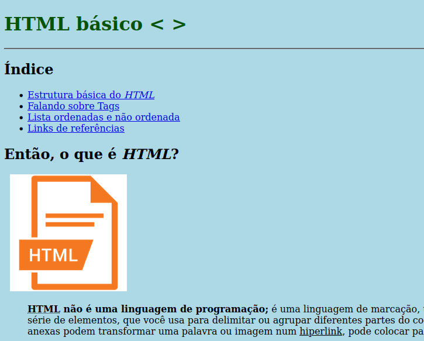

<h1 align="center"> Criar Uma Página Web Utilizando as Tags Aprendidas </h1>

  

 

  

## 🚀 Tecnologias

Esse projeto foi desenvolvido:

- HTML 

## 💻 Projeto

A ideia deste Desafio de Projeto é elaborar um website, utilizando uma estrutura bem básica, utilizando tags aprendidas durante as aulas práticas:
 

- Utilizar todas as tags explicadas nas aulas: `<h1> até <h6>, 
, <mark>, <small>, <i>, <u>, <strong>, <ol>, <ul>, <li>, <a>, 
, , , <blockquote>;`
- Utilizar novas tags sugeridas: `, <del>, 
, <abbr>` (a ideia é buscar estas tags na internet, entender como ela funciona e utilizar no texto).

## :memo: Licença

Esse projeto está sob a licença MIT.